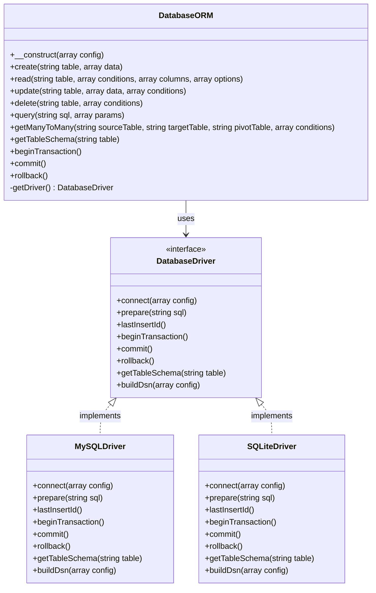

# Logbie Framework: Database Integration Strategy

## 1. Current Implementation Analysis

The current DatabaseORM implementation in the Logbie Framework is designed primarily for MySQL/MariaDB databases. Key observations:

### 1.1 Current Architecture

- **PDO-Based**: Uses PHP's PDO extension for database connectivity
- **MySQL-Centric**: DSN string format and SQL syntax are MySQL-specific
- **Features**:
  - Prepared statement caching
  - Schema information caching
  - Transaction support with nesting levels
  - CRUD operations
  - Many-to-many relationship handling
  - Raw query execution

### 1.2 MySQL-Specific Elements

- **Connection String**: Format is specific to MySQL (`mysql:host=...`)
- **Schema Retrieval**: Uses `DESCRIBE table` which is MySQL syntax
- **Default Configuration**: Default values for host, port, and charset are MySQL-oriented
- **SQL Dialect**: Some SQL operations may use MySQL-specific syntax

### 1.3 Configuration Approach

- Configuration is passed as an array to the DatabaseORM constructor
- The Application class registers a 'db' service with default configuration
- Environment variables can override default configuration values

## 2. Database Abstraction Layer Design

To support both SQLite and MySQL, we'll implement a database abstraction layer that maintains the current API while handling database-specific differences internally.

### 2.1 Architecture Overview



### 2.2 Key Components

1. **DatabaseDriver Interface**:
   - Defines common methods for all database drivers
   - Abstracts database-specific operations

2. **Driver Implementations**:
   - MySQLDriver: Handles MySQL-specific operations
   - SQLiteDriver: Handles SQLite-specific operations

3. **Factory Method**:
   - Creates appropriate driver based on configuration
   - Encapsulates driver instantiation logic

4. **Configuration Manager**:
   - Validates and normalizes configuration for each driver
   - Provides default values appropriate to each database system

### 2.3 Implementation Strategy

1. **Refactor Current Implementation**:
   - Extract MySQL-specific code into MySQLDriver
   - Update DatabaseORM to use the driver interface

2. **Add SQLite Driver**:
   - Implement SQLiteDriver with SQLite-specific operations
   - Handle SQLite connection string and schema retrieval

3. **Update Configuration Handling**:
   - Enhance configuration to support both database types
   - Provide sensible defaults for each database type

4. **Maintain Backward Compatibility**:
   - Ensure existing code continues to work without changes
   - Default to MySQL driver if not specified

## 3. Database-Specific Considerations

### 3.1 SQLite Considerations

#### 3.1.1 Connection Configuration
- **File-based**: SQLite uses file paths instead of host/port
- **Memory Database**: Support for `:memory:` databases
- **Directory Management**: Ensure database directory exists

#### 3.1.2 Feature Limitations
- **Concurrency**: Limited support for concurrent writes
- **ALTER TABLE**: Limited support for schema modifications
- **Data Types**: Different type system from MySQL
- **Foreign Keys**: Must be explicitly enabled

#### 3.1.3 Performance Considerations
- **Journal Mode**: Configure WAL for better performance
- **Synchronization**: Configure synchronous mode based on needs
- **Temporary Tables**: Use temp tables for better performance

### 3.2 MySQL Considerations

#### 3.2.1 Connection Configuration
- **Host/Port**: Network connection parameters
- **SSL/TLS**: Secure connection options
- **Character Set**: UTF-8MB4 for full Unicode support

#### 3.2.2 Feature Advantages
- **Full SQL Support**: More complete SQL implementation
- **Stored Procedures**: Support for server-side procedures
- **Advanced Indexing**: More index types and options
- **Replication**: Support for master-slave setups

#### 3.2.3 Performance Considerations
- **Connection Pooling**: Persistent connections
- **Query Cache**: Utilize MySQL query cache
- **Prepared Statement Caching**: Already implemented

## 4. Configuration Structure

### 4.1 Enhanced Configuration Array

```php
$config = [
    // Common configuration
    'driver' => 'mysql', // or 'sqlite'
    'charset' => 'utf8mb4',
    
    // MySQL-specific configuration
    'mysql' => [
        'host' => 'localhost',
        'port' => '3306',
        'database' => 'logbie',
        'username' => 'root',
        'password' => 'secret',
        'options' => [
            // PDO options specific to MySQL
        ]
    ],
    
    // SQLite-specific configuration
    'sqlite' => [
        'database' => '/path/to/database.sqlite',
        'foreignKeys' => true, // Enable foreign key constraints
        'journalMode' => 'WAL', // Write-Ahead Logging
        'options' => [
            // PDO options specific to SQLite
        ]
    ]
];
```

### 4.2 Environment Variables

```
# Common
DB_DRIVER=mysql|sqlite
DB_CHARSET=utf8mb4

# MySQL
MYSQL_HOST=localhost
MYSQL_PORT=3306
MYSQL_DATABASE=logbie
MYSQL_USERNAME=root
MYSQL_PASSWORD=secret

# SQLite
SQLITE_DATABASE=/path/to/database.sqlite
SQLITE_FOREIGN_KEYS=true
SQLITE_JOURNAL_MODE=WAL
```

### 4.3 Configuration File Structure

```php
// config/database.php
return [
    'default' => env('DB_DRIVER', 'mysql'),
    
    'connections' => [
        'mysql' => [
            'driver' => 'mysql',
            'host' => env('MYSQL_HOST', 'localhost'),
            'port' => env('MYSQL_PORT', '3306'),
            'database' => env('MYSQL_DATABASE', 'logbie'),
            'username' => env('MYSQL_USERNAME', 'root'),
            'password' => env('MYSQL_PASSWORD', ''),
            'charset' => env('DB_CHARSET', 'utf8mb4'),
            'options' => [
                // PDO options
            ]
        ],
        
        'sqlite' => [
            'driver' => 'sqlite',
            'database' => env('SQLITE_DATABASE', '/path/to/database.sqlite'),
            'foreignKeys' => env('SQLITE_FOREIGN_KEYS', true),
            'journalMode' => env('SQLITE_JOURNAL_MODE', 'WAL'),
            'charset' => env('DB_CHARSET', 'utf8mb4'),
            'options' => [
                // PDO options
            ]
        ]
    ]
];
```

## 5. Consistent Cross-Database Handling

### 5.1 Transaction Management

Both MySQL and SQLite support transactions, but with some differences:

- **Implementation**: Use PDO's transaction methods for both drivers
- **Nested Transactions**: Maintain current nesting level tracking
- **Savepoints**: Consider adding savepoint support for true nested transactions
- **Error Handling**: Consistent error handling across both systems

### 5.2 Prepared Statements

Both databases support prepared statements through PDO:

- **Caching**: Maintain current statement caching mechanism
- **Parameter Binding**: Use consistent parameter binding approach
- **Emulation**: Configure PDO to use native prepared statements when possible

### 5.3 Error Handling

Create a consistent error handling approach:

- **Exception Wrapping**: Wrap PDO exceptions in framework-specific exceptions
- **Error Codes**: Map database-specific error codes to framework error codes
- **Detailed Messages**: Provide helpful error messages for common issues
- **Logging**: Log database errors with appropriate context

### 5.4 SQL Dialect Differences

Handle SQL syntax differences:

- **Schema Queries**: Use database-specific methods for schema information
- **LIMIT/OFFSET**: Handle syntax differences in pagination
- **AUTO_INCREMENT**: Handle identity column differences
- **Data Types**: Map between database-specific data types

## 6. Testing Strategy

### 6.1 Unit Testing

- **Driver Tests**: Test each driver implementation separately
- **Mock PDO**: Use mock PDO objects for isolated testing
- **Configuration Tests**: Verify configuration handling for each driver

### 6.2 Integration Testing

- **Real Databases**: Test against actual MySQL and SQLite databases
- **CRUD Operations**: Verify all CRUD operations work correctly
- **Transaction Tests**: Ensure transactions work as expected
- **Edge Cases**: Test error conditions and edge cases

### 6.3 Test Matrix

| Test Category | MySQL | SQLite |
|---------------|-------|--------|
| Connection    | ✓     | ✓      |
| CRUD Operations | ✓   | ✓      |
| Transactions  | ✓     | ✓      |
| Schema Queries | ✓    | ✓      |
| Error Handling | ✓    | ✓      |
| Performance   | ✓     | ✓      |

### 6.4 Automated Testing

- **CI Pipeline**: Add tests to CI pipeline
- **Database Fixtures**: Create test fixtures for both databases
- **Environment Setup**: Automate test environment setup

## 7. Implementation Plan

### 7.1 Phase 1: Refactoring

1. Create DatabaseDriver interface
2. Extract MySQL-specific code into MySQLDriver
3. Update DatabaseORM to use driver pattern
4. Ensure backward compatibility

### 7.2 Phase 2: SQLite Implementation

1. Implement SQLiteDriver
2. Add SQLite-specific configuration handling
3. Test SQLite implementation
4. Document SQLite support

### 7.3 Phase 3: Enhanced Features

1. Add database-specific optimizations
2. Implement savepoints for nested transactions
3. Add connection pooling improvements
4. Enhance error handling and reporting

### 7.4 Phase 4: Documentation and Examples

1. Update documentation with SQLite examples
2. Create migration guide for existing applications
3. Add configuration examples for both databases
4. Document performance considerations

## 8. Conclusion

This database integration strategy provides a comprehensive approach to supporting both SQLite and MySQL in the Logbie Framework. By implementing a driver-based abstraction layer, we can maintain a consistent API while handling database-specific differences internally. This approach ensures backward compatibility while adding new functionality.

The implementation will follow SOLID principles, particularly the Dependency Inversion Principle, by depending on abstractions rather than concrete implementations. This will make the system more maintainable and extensible, allowing for additional database drivers in the future if needed.